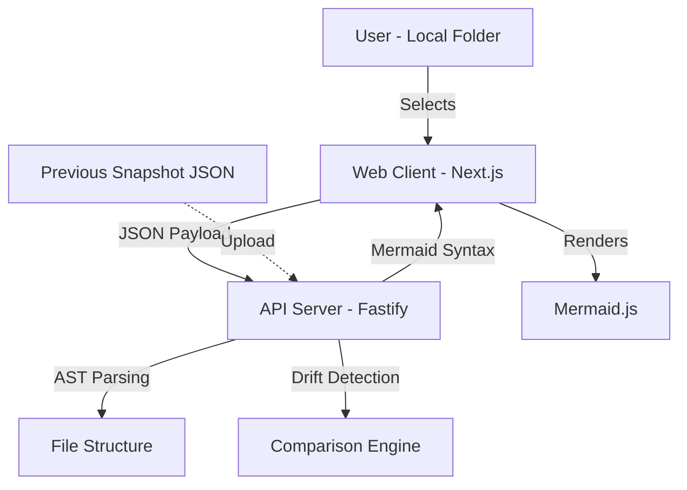
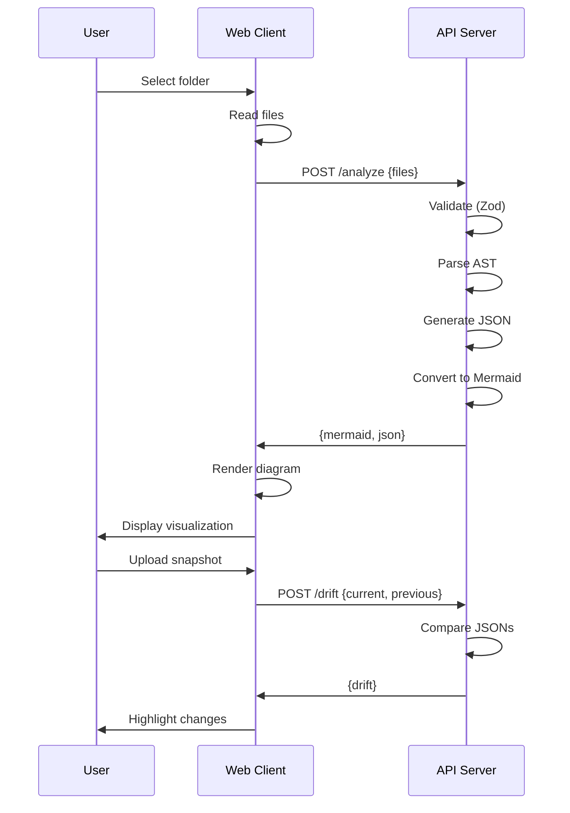

# Architecture

## Overview

Developer tool visualizing local repository structure and detecting architectural drift. Client-Server model: API handles parsing, client stays lightweight.

## System Components



## Tech Stack

| Layer | Technology |
|-------|-----------|
| Frontend | Next.js 14+ (App Router), TypeScript (Strict), Tailwind CSS |
| Backend | Fastify |
| State | Zustand |
| Validation | Zod (Shared Schemas) |
| Visualization | Mermaid.js |

## Data Flow

### 1. Ingest (Web)
User selects local folder via file picker.

### 2. Transmission
Web client sends JSON payload to API server.

### 3. Processing (API)
1. Validate input (Zod schema).
2. Parse file imports/structure (AST).
3. Generate Canonical Architecture JSON.
4. Convert to Mermaid syntax.

### 4. Visualization (Web)
Render Mermaid syntax as interactive diagram.

## Key Features

### Visualizer
- **File Dependency Graph**: `graph LR` - horizontal flow of imports/exports.
- **System Architecture**: `graph TB` - top-down component hierarchy.

### Drift Detection
- Compares current code (uploaded) vs. previous JSON snapshot (user-uploaded).
- Highlights:
  - New files/dependencies.
  - Removed files/dependencies.
  - Changed relationships.

### Strict Typing
- Shared Zod schemas between Web and API.
- Type-safe request/response contracts.
- Validation at boundaries.

## Architecture Principles

1. **Separation of Concerns**: Heavy computation on server, rendering on client.
2. **Type Safety**: Zod schemas enforce contract at runtime + compile time.
3. **Stateless API**: Each request self-contained.
4. **Client Lightweight**: No AST parsing in browser.

## Data Structures

### Canonical Architecture JSON
```typescript
{
  files: File[],           // All parsed files
  dependencies: Dep[],     // Import relationships
  metadata: Meta           // Timestamp, version
}
```

### Drift Result
```typescript
{
  added: string[],         // New files
  removed: string[],       // Deleted files
  modified: Change[]       // Changed dependencies
}
```

## Request/Response Flow


